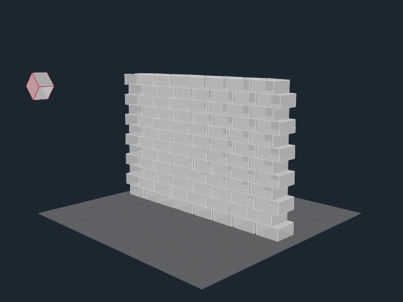
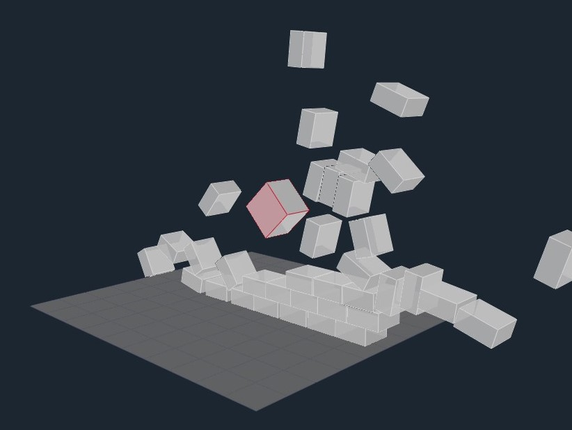

# MultiRigidBody
CS171.1 Computer Graphics (2018 Spring) Final Project

# Release 
The Project1.exe in Release folder is the demo program. Use keyboard to control interaction with the world.

### There are 4 demos in the program:

* Demo1: A heavy box on the ground.

* Demo2: Two columns of Cubes.

* Demo3: A pyramid of Boxes.

* Demo4: A wall is made of almost 200 bricks.

### Control

* Number 1,2,3,4: Switch to the demo1, demo2, demo3 and demo4.

* Space: Launch the normal "bomb".

* B: Launch the heavier "bomb".

* N: Shoot the normal "bomb" horizontally.

* ESC: Exit.

# Video
The link below is the video of our demo.

Wait, video is not ready.

